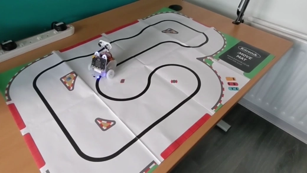
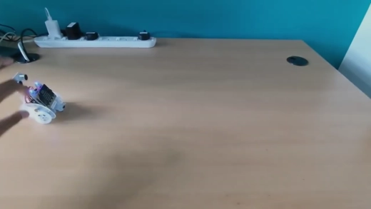
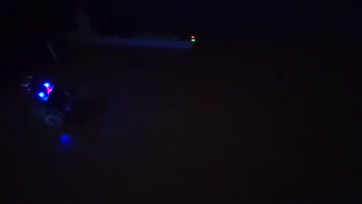
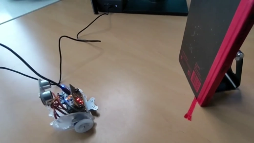

# Ring:bit Programmable Car Library
Open-source library of computer programs written in Python 3 for the Ring:bit programmable car. The library includes programs for accelerating and reversing, measuring light levels, following a route (black line detection), and automatic obstacle detection and avoidance.

## Getting Started

In order to upload the computer programs in this library to your Ring:bit programmable car, please follow the instructions below to setup your development environment and to connect your Ring:bit car to your computer via the Micro:bit controller and the WebUSB protocol.

1. Open your internet browser (Google Chrome recommended).
2. Navigate to [Microsoft MakeCode for Micro:bit](https://makecode.microbit.org).
3. Select "New Project".
4. Select "Python" from the top menu bar.
5. Select "Extensions" from the commands menu.
6. Search for "ringbitcar".
7. Select and install the "ringbitcar - ElecFreaks motor:bit package for the Ring:bit car (瑞比特)" package.
8. Physically connect your Ring:bit car to your computer via a micro USB cable linking the micro USB port on the Micro:bit controller to a USB port.
9. Select "..." to the right of the "Download" button.
10. Select "Connect Device" and follow the instructions to connect your Ring:bit car to the Microsoft MakeCode online editor via the WebUSB protocol.

Assuming that you have followed the instructions above successfully, you can now copy and paste the Python code from one of the Python scripts in this open-source library to your Microsoft MakeCode online editor. Then press the "Download" button to directly transfer the program from your internet browser to the Micro:bit's flash memory via direct flashing enabled by the WebUSB protocol.

## Car Library

This open-source library currently contains the following Python 3 computer programs for the Ring:bit programmable car.

### 1. Drive and Reverse

The [drive_and_reverse.py](https://github.com/flanagkl/ringbit-car/blob/main/drive_and_reverse.py) program will instruct the Ring:bit car to move forwards, reverse and brake as a result of physically pressing the A, B and A+B buttons found on the front of the Micro:bit controller.

### 2. Follow a Route (Black Line Detection)

The [follow_a_route.py](https://github.com/flanagkl/ringbit-car/blob/main/follow_a_route.py) program will instruct the Ring:bit car to follow a route by performing black line detection using its infrared sensors. The Ring:bit car will start following a route when the A button is physcially pressed on the front of the Micro:bit controller.

### 3. Follow the Light (Light Level Detection)

The [follow_the_light.py](https://github.com/flanagkl/ringbit-car/blob/main/follow_the_light.py) program will instruct the Ring:bit car to follow a light source by performing light level detection using the light sensors natively integrated with the LEDs on the front of the Micro:bit controller.

### 4. Obstacle Detection and Avoidance

The [obstacle_avoidance.py](https://github.com/flanagkl/ringbit-car/blob/main/obstacle_avoidance.py) program will instruct the Ring:bit car to automatically detect and move to avoid obstacles using its ultrasonic sonar sensor. The Ring:bit car will start moving and automatically perform obstacle avoidance when the A button is physcially pressed on the front of the Micro:bit controller.

